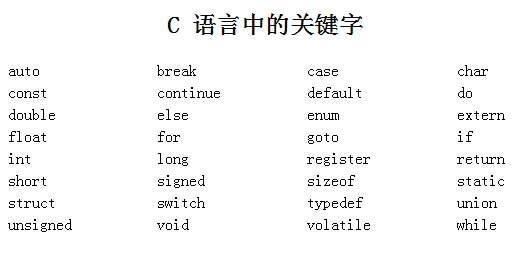

# C语言复习笔记

## 1.绪论

### Hello World！

```c
#include <stdio.h>
int main() {
	printf("Hello, World!\n");
	return 0;
}
```

### 预处理

 处理指令以`#`开头，通常出现在源代码的最前面。预处理器在编译之前处理这些指令。

 编译器将*.h*和*.c*文件，通过**预处理**生成一个*.i*文件，通过编译后生成一个*.s*(汇编代码)文件，最后通过汇编器生成一个*.o*文件。

 ### include

  `#include`指令用于包含头文件。头文件通常包含函数声明、宏定义和其他必要的代码。
	
把头文件中的文件内容复制到指令所在的位置。

### define
  `#define`指令用于定义宏。宏是一种文本替换机制，可以在代码中使用宏名来代替宏的值。
 预处理器会将所有的宏名替换为宏的值。
   ```c
   #define N 5  // 定义宏N为5
   
   #define Foo(x) (1+(x) * (x))  // 带参数的宏（宏函数）（文本替换：用“实参”替换“形参”）
   ```
**怎么用宏函数？**

 - a. 左括号要紧跟着宏函数名字
	
 - b."参数"要加括号
	
 - c.整个表达式也要加括号
	
**为什么要用宏函数？**

 - a.避免函数调用的开销：简短频繁调用。

 - b.提供了一定的“宏编程”

### 变量

 变量要**绑定**一个值

 三要素：

 - 变量名：引用**绑定**的值

 - 类型：
	- 1.限定了值得范围：编码 内存大小
	
    - 2.限定了值的操作：语义

 - 值

### 标识符
 标识符是变量、函数、类型等的名称。标识符由字母、数字和下划线组成，**不能以数字开头**。

 - 1.字母：**区分大小写**
	
 - 2.数字：0-9
 
- 3.下划线：_

- 4.长度：不超过31个字符

- 5.不能是关键字

### 关键字
 关键字是C语言中预定义的保留字，不能用作标识符。C语言的关键字包括：

 