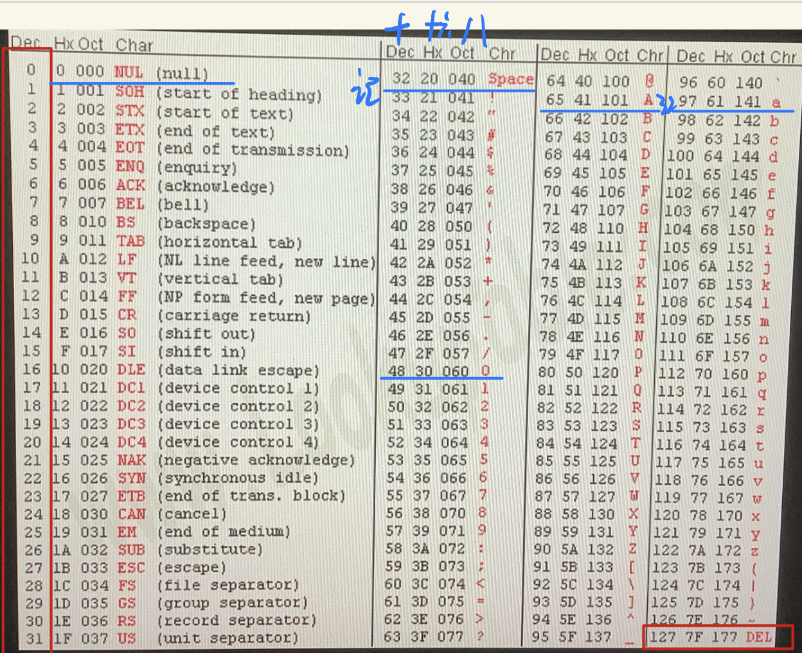
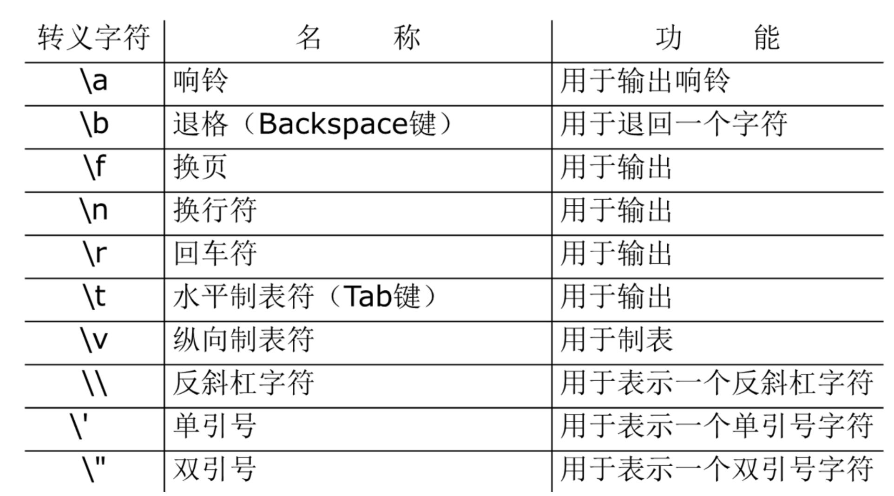
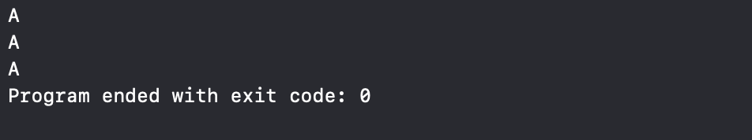
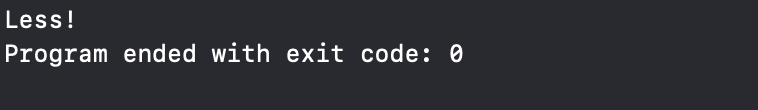

# C语言复习笔记

## 1.绪论

### Hello World！

```c
#include <stdio.h>
int main() {
	printf("Hello, World!\n");
	return 0;
}
```

## 预处理

 处理指令以`#`开头，通常出现在源代码的最前面。预处理器在编译之前处理这些指令。

 编译器将*.h*和*.c*文件，通过**预处理**生成一个*.i*文件，通过编译后生成一个*.s*(汇编代码)文件，最后通过汇编器生成一个*.o*文件。

 ## include

  `#include`指令用于包含头文件。头文件通常包含函数声明、宏定义和其他必要的代码。
	
把头文件中的文件内容复制到指令所在的位置。

## define
  `#define`指令用于定义宏。宏是一种文本替换机制，可以在代码中使用宏名来代替宏的值。
 预处理器会将所有的宏名替换为宏的值。
   ```c
   #define N 5  // 定义宏N为5
   
   #define Foo(x) (1+(x) * (x))  // 带参数的宏（宏函数）（文本替换：用“实参”替换“形参”）
   ```
**怎么用宏函数？**

 - a. 左括号要紧跟着宏函数名字
	
 - b."参数"要加括号
	
 - c.整个表达式也要加括号
	
**为什么要用宏函数？**

 - a.避免函数调用的开销：简短频繁调用。

 - b.提供了一定的“宏编程”

## 变量

 变量要**绑定**一个值

### 三要素：

 - 变量名：引用**绑定**的值

 - 类型：
	- 1.限定了值得范围：编码 内存大小
	
    - 2.限定了值的操作：语义

 - 值

## 标识符
标识符是变量、函数、类型等的名称。标识符由字母、数字和下划线组成，**不能以数字开头**。

- 1.字母：**区分大小写**
	
- 2.数字：0-9
 
- 3.下划线：_

- 4.长度：不超过31个字符

- 5.不能是关键字

## 关键字
 关键字是C语言中预定义的保留字，不能用作标识符。C语言的关键字包括：
  ```c
  auto        break       case        char

  const       continue    default     do
  
  double      else        enum        extern

  float       for         goto        if

  int         long        register    return

  short       signed      sizeof      static

  struct      switch      typedef     union

  unsigned    void        volatile    while
  ```

## printf 函数

- 由来
  ```c
  printf = print + format(格式化)
  ```
- 作用

打印格式串中的内容，并用后面表达式的值替换格式串中的转换说明。

### 格式串

#### 普通字符：原样输出

#### 转换说明：占位符

##### 转换说明的格式

     `%m.pX`   `X`:类型如何转换符数据

     `%-m.pX`   `m`:最小字段转换宽度

      `-`号的意义：左对齐。在右边添加空格。
      
      `f` `.float`

      `d` `.decimal`

      `X`:类型如何转换符的数据

      `m`:最小字段宽度 `%+d`

      `P`:精度

      `%d`:最少显示数字个数。不够前面显示0。

      `%f`:显示小数的位数

### 转换说明

    类型转换:`X`

    `-m.p`:控制输出格式

## scanf 函数

```c

scanf = scan + format

        扫描
```
### 原理：

**从左到右，依次匹配格式串中的每一项**

**如果有一项匹配不成功,`scanf`会立即返回。**

  返回值：返回的是匹配成功的，转换说明的个数。

`%d`忽略前置**空白**的字符

```c
空格，  tab,   /n,  /v
```

### 格式串

    普通字符:**精确匹配**

    空白字符:空格  \n  \v **匹配任意个空白字符**

    转换说明
 
## 整数的编码

 - 无符号整数：二进制编码
 
 - 有符号整数：补码

## 浮点数
 
 编码：IEEE754

 浮点数是不精确的

## 字符的编码

 ASCII（1字节，低7位，128个）
  


`Dec`:十进制

`Hx`：十六进制

`Oct`：八进制

```c
0-31 和 127 为控制字符

null space  0  A  a   需要记忆 
```
## 类型

- 限定值的取值

    - 编码（ASCII）

    - 内存大小（1字节）

- 限定值能进行的操作

### 一、表示值

  `'a'`  `'A'`

#### 转义序列：

##### 1.字符转义序列

 

##### 2.数字转义序列

  八进制（最多3个）`\    `

  十六进制        `\xABC`

```c
#include <stdio.h>

int main(void){
    printf("%c\n",'A');
    printf("%c\n",'\101');
    printf("%c\n",'\x41');
    return 0;
}
```


### 二、支持哪些操作

#### C语言将`char`当作**一个字节**的整数处理

#### `<ctype.h>`有一些字符分类函数：扩展了字符类型支持的操作

#### [C reference.com可以查看C标准](https://en.cppreference.com/w/c)

### 三、读/写（和用户交互）

- `printf + % c`

- `scanf + % c`
        `匹配一个字符，不会忽略空白字符`

#### putchar(C);

#### c= getchar ();

#### 固定搭配

```c
while (getchar()!='\n');  //跳过这一行的剩余字符
```
## 类型转换

### 隐式转换 ：IDE自动

#### 整数提升

比`int`小的会都会被提升成`int`类型

- C语言处理`int`类型最快，处理`int`最自然

#### 值的表示范围

小→大

`char`  → `int` →  `long long` →  `float` →  `double`

#### 同一整数转换等级

有符号→无符号

```c
#include <stdio.h>
int main(void){
  int i = -1;
  unsigned int u = 100;
  if (u >i){
    printf("Greater\n");
  }else{
    printf("Less!\n");
  }
}
```
