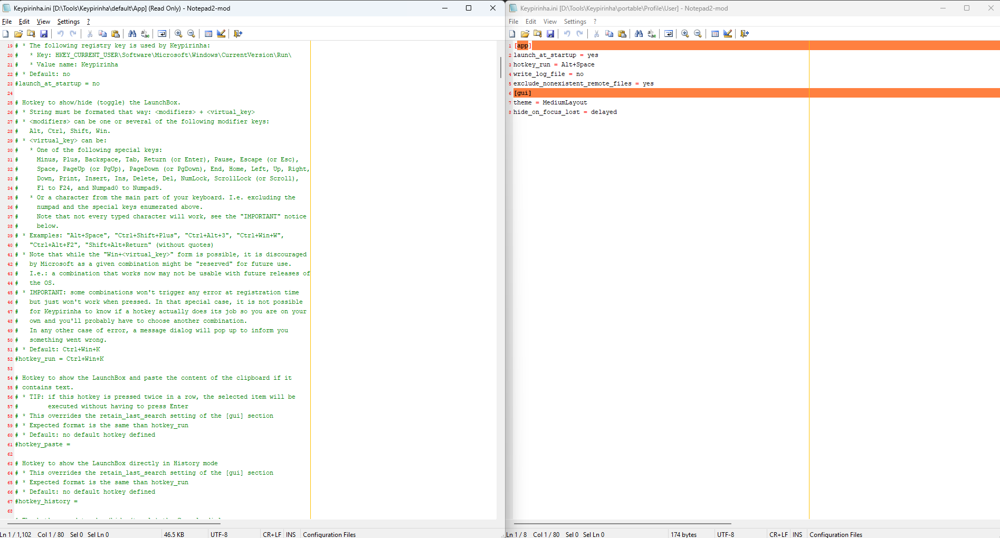

# Keypirinha

Keypirinha是一个快速启动器和应用程序启动器，类似于Alfred、LaunchBar和Quicksilver等工具。
它允许用户通过键盘快捷键快速访问文件、文件夹、应用程序和其他资源。
Keypirinha具有高度的可定制性和扩展性，支持插件和脚本，可以根据用户的需求进行个性化设置。

最重要的：**占用资源极少，不装插件情况下，内存占用30MB左右**。装了插件也就40MB左右。
小而美。

## 安装

- 仅windows

下载[Keypirinha](https://keypirinha.com/)的最新64位版本

解压到任意目录

## 启动

双击`Keypirinha.exe`，会在右下角的托盘区显示一个图标

默认快捷键`Ctrl + Win + K`，可以打开Keypirinha的搜索框

## 修改配置文件

由于我是在Mac上用的是Alfred，所以我习惯了`Cmd + Space`，所以我把快捷键改成了`Ctrl + Space`

在右下角系统托盘区右键点击Keypirinha图标，选择`Configuration`，打开配置文件

第一次打开会出现俩个配置文件，左侧是默认配置文件，右侧是用户配置文件。

我们在右侧的用户配置文件中进行修改，左侧的默认配置文件不要动。



我们在右侧配置文件中添加如下代码：
```ini

[app]
launch_at_startup = yes	//随系统启动

hotkey_run = Alt+Space	//修改启动快捷键

write_log_file = no		//是否写入日志文件。删掉这个，默认的配置文件中是yes

exclude_nonexistent_remote_files = yes //自动从搜索结果中过滤掉已经不存在的远程文件

[gui]

theme = MediumLayout	//主题中号，去掉上面很大的Keypirinha图标

hide_on_focus_lost = delayed //失去焦点后延迟隐藏
```
保存后，右键点击托盘区的Keypirinha图标，选择`Reload Configuration`，使配置生效。

## Keypirinha.ini 文件解释

### 1. 应用核心 ([app])

开机启动`launch_at_startup`: 是否在 Windows 启动时自动运行。

主启动热键`hotkey_run`: 设置用于显示/隐藏搜索主窗口的热键。

粘贴热键`hotkey_paste`: 设置一个热键，用于打开并自动粘贴剪贴板中的文本内容。

历史记录热键`hotkey_history`: 设置一个热键，用于直接以历史记录模式打开 Keypirinha。

控制台热键`hotkey_console`: 设置用于显示/隐藏 Keypirinha 开发者控制台的热键。

日志记录`write_log_file`: 是否将运行日志写入文件（方便排查问题）。

忽略的包`ignored_packages`: 可以指定禁用某些插件（Packages）。

结果过滤:

`exclude_nonexistent_local_files`: 自动从搜索结果中过滤掉已经不存在的本地文件。

`exclude_nonexistent_remote_files`: 自动从搜索结果中过滤掉已经不存在的远程文件。

### 2. 图形界面 ([gui])

窗口位置与大小`geometry, auto_width`: 控制主窗口如何定位（自动、指定显示器、跟随鼠标、固定位置）以及自动模式下的宽度百分比。

总在最前`always_on_top`: 主窗口是否始终保持在其他窗口之上。

失焦隐藏`hide_on_focus_lost`: 当窗口失去焦点时如何隐藏（立即、延迟、不隐藏）。

保留上次搜索`retain_last_search`: 重新打开窗口时是否保留上一次的搜索词（并可选是否预先选中）。

Esc 键行为`escape_always_closes`: `Esc 键是仅清除搜索框内容还是直接关闭窗口。

空格键作为Tab`space_as_tab`: 在搜索的第一步，是否允许使用空格键代替` Tab` 键来进入下一步（例如选择动作）。

列表循环滚动`loop_list`: 结果列表滚动到末尾/开头时是否循环。

单击模式`single_click`: 是否启用单击直接执行项目（类似网页链接）。

最大窗口高度`max_height`: 限制结果列表区域最多显示多少个项目（超出则需要滚动）。

任务栏显示`show_on_taskbar`: 激活时是否在任务栏显示图标。

最大结果数`max_results`: 限制一次搜索最多返回多少条结果。

单词分隔符`word_separators`: 定义在编辑框内使用` Ctrl+左右箭头` 或` Ctrl+Backspace `时的单词边界字符。

界面主题`theme`: 选择应用的视觉主题（颜色、字体、布局），可以层叠多个主题。

### 3. 外部程序 ([external])

文本编辑器`editor, config_editor`: 指定用于编辑文件和编辑 Keypirinha 配置文件的外部文本编辑器。

终端模拟器`terminal`: 指定用于运行命令行程序或脚本的终端（如 ConEmu, Windows Terminal 等）。

文件浏览器`file_explorer`: 指定替代 Windows 资源管理器的文件浏览器。

网页浏览器`web_browser, web_browser_new_window, web_browser_private_mode`: 指定替代系统默认的网页浏览器，并设置默认是否在新窗口或隐私模式下打开链接。

### 4. 控制台 ([console])

控制台窗口位置`geometry`: 设置开发者控制台窗口的位置（类似主窗口）。

显示时间戳`show_time_prefix`: 控制台日志是否显示时间前缀。

消息闪烁提示`flash_on`: 当控制台窗口在后台时，收到特定级别（如警告、错误）的消息时是否闪烁任务栏图标提示。

控制台别名`alias_*`: 可以定义在控制台中使用的命令别名，简化常用操作。

### 5. 网络 ([network])

代理设置`proxy`: 配置 Keypirinha 及其插件进行网络连接时使用的代理服务器（系统设置、无代理、指定代理地址）。
### 6. 变量与环境 ([var], [env])

变量`[var]`: 可以定义一些变量，在配置文件的其他地方引用。Keypirinha 也预定义了一些变量（如程序路径、配置路径等）。
环境变量`[env]`: 可以通过 ${env:变量名} 的方式直接访问系统的环境变量。
### 7. 主题定义 ([theme/...])

文件末尾包含了多个预定义的主题示例（如 ElectricStateColors, SolarizedLightColors, MonokaiColors, AnthraciteFull, TinyLayout 等）。

[theme/Default] 部分详细列出了所有可用的主题配置项，包括：

字体 `font_face, font_*_size, font_*_style, mono_font_*`

颜色 `color_*`

透明度`opacity_back`

界面元素布局`layout, compact_results, satellite_*`

边距与填充`control_margin, textbox_padding, listitem_padding`

## 插件

Keypirinha 的插件系统允许用户安装和使用各种插件来扩展其功能。

### Keypirinha Package Control

Keypirinha Package Control 是 Keypirinha 的官方插件管理器，允许用户轻松安装、更新和删除插件。

#### 安装

打开右键Keypirinha选择`Open Console`

在控制台中输入以下命令：
```python

import keypirinha as kp,keypirinha_net as kpn,os;p="PackageControl.keypirinha-package";d=kpn.build_urllib_opener().open("https://github.com/ueffel/Keypirinha-PackageControl/releases/download/1.0.5/"+p);pb=d.read();d.close();f=open(os.path.join(kp.installed_package_dir(),p),"wb");f.write(pb);f.close()

```
[查看更多和参考](https://github.com/ueffel/Keypirinha-PackageControl)

### Kill

Kill 是一个 Keypirinha 插件，用于快速关闭应用程序。

类似于 Mac 上的`Cmd + Q`，可以快速关闭当前应用程序。还有Alfred的`Quit`功能。

#### 安装
在 按快捷键启动Keyprinha中搜索`Install Package "Keypirinha-Plugin-Kill"`，安装即可。

- 需要先安装`Keypirinha Package Control`插件。

[查看更多和参考](https://github.com/ueffel/Keypirinha-Plugin-Kill)

